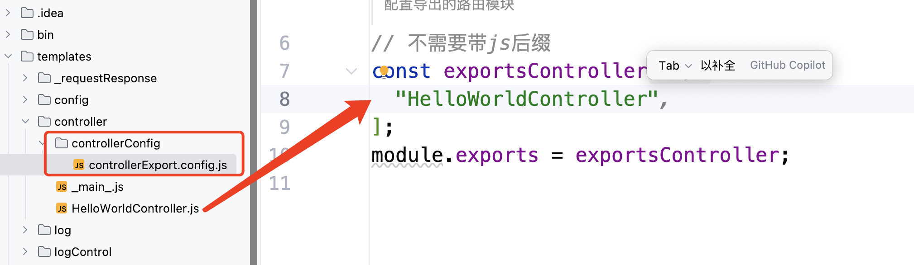

# 如何创建一个路由文件
``controller``目录下新建一个文件
- 例如 test.js
```js


const controller_func = async (req, res) => {
  // 这里是接口逻辑
  res.send('Hello World');
}
const controller = {
  method: 'get',
  path: '/test',
  func: controller_func
}
module.exports = [
  
]
```

# 将其导出到 
``controllerExport.config.js``

 
